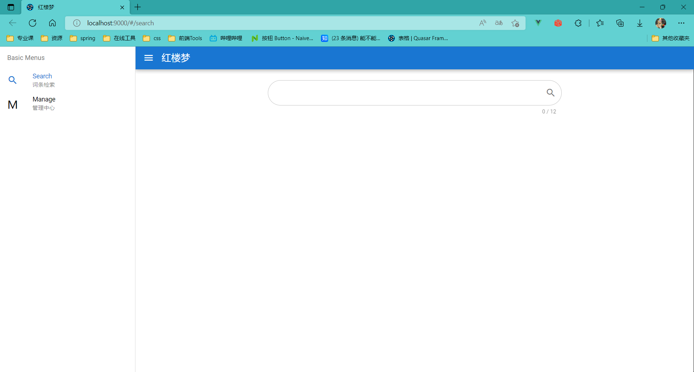
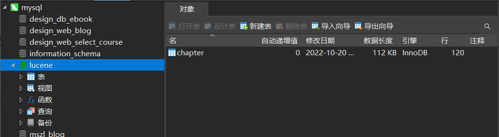
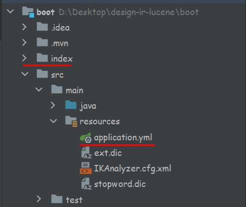
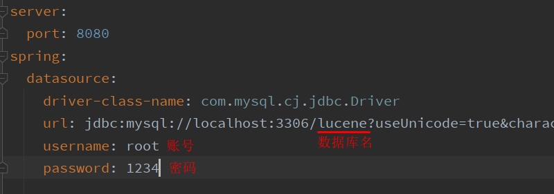
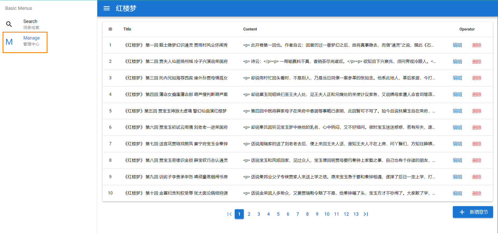
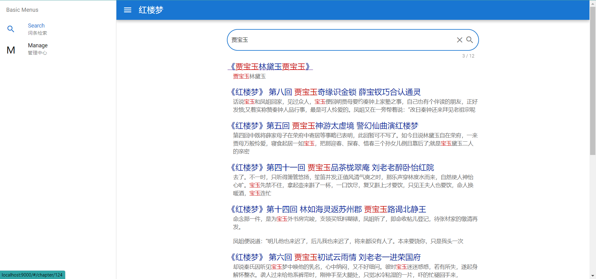
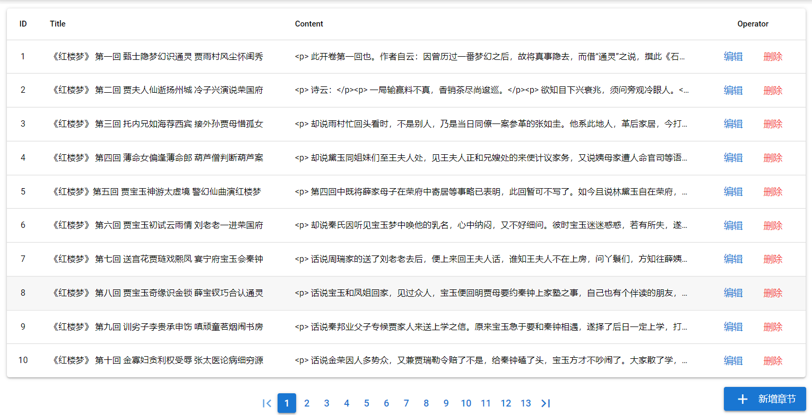
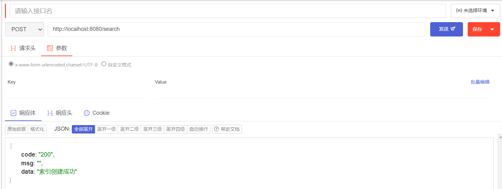

# 项目启动步骤

## 框架选取

`Vue.js` + `Quasar UI` + `Spring Boot`


## 前端配置

打开 命令行，进入`quasar` 文件夹，`cnpm install` 安装依赖

执行`quasar dev` 启动前端，弹出如下页面则启动成功




## 后端配置

### 一、数据库配置

MySQL 建立数据库， 名为 `lucene`，执行 目录下的 `lucene.sql`  ，生成 `chapter` 表，表内容应为红楼梦的所有章节



### 二、Spring Boot 配置

用 `IntelliJ IDEA` 打开`boot`文件夹，目录结构如下



在 `application.yml` 中，将用户名和密码修改为本机 `MySQL `的用户名和密码



运行后端，此时点击管理页面，出现数据即前后端成功通信，**项目启动完成。**



> 搜索功能：




> 管理功能：

在管理页面进行**章节**<chapter>的增删改之后，索引库会自动更新响应的索引



```java
@PostMapping
public Result saveOrUpdateChapter(@RequestBody Chapter chapter) {
    chapterService.saveOrUpdate(chapter);
    //增加或修改索引
    indexService.saveOrUpdateIndex(chapter);
    return Result.success();
}

@DeleteMapping("{id}")
public Result deleteChapter(@PathVariable Integer id) {
    //删除索引
    indexService.deleteIndex(id);
    chapterService.removeById(id);
    return Result.success();
}
```


【补充】：`index` 文件为项目的索引库存放的位置，如果删除，可以向后端发送 `post` 请求： [http://localhost:8080/search](http://localhost:8080/search)，**后端会自动根据数据库文件重新生成索引**



